# Data Analysis with Python

The data used here (automobile) can be downloaded at [https://archive.ics.uci.edu/dataset/10/automobile](https://archive.ics.uci.edu/dataset/10/automobile) or better at [https://archive.ics.uci.edu/ml/machine-learning-databases/autos/imports-85.data](https://archive.ics.uci.edu/ml/machine-learning-databases/autos/imports-85.data)

|Variable Name     |	Role    |Type         |	Description                                  |	Units |	Missing Values|
|:-----------------|:----------|:-------------|:---------------------------------------------|:-------|:--------------|
|price	           |Feature    | Continuous   |continuous from 5118 to 45400                 |        | yes           |
|highway-mpg	   |Feature	   | Continuous   |continuous from 16 to 54		                 |        |no             |
|city-mpg	       |Feature	   | Continuous   |continuous from 13 to 49	                	 |        |no             |
|peak-rpm	       |Feature    |Continuous	  |continuous from 4150 to 6600                  |        |yes            |
|horsepower	       |Feature	   |Continuous	  |continuous from 48 to 288                     |		  |yes            |
|compression-ratio |Feature	   |Continuous	  |continuous from 7 to 23	                     |	      |no             |
|stroke	           |Feature	   |Continuous	  |continuous from 2.07 to 4.17             	 |	      |yes            |
|bore	           |Feature	   |Continuous	  |continuous from 2.54 to 3.94	                 | 	      |yes            |
|fuel-system	   |Feature	   |Categorical	  |1bbl, 2bbl, 4bbl, idi, mfi, mpfi, spdi, spfi  |	      |no             |
|engine-size	   |Feature	   |Continuous	  |continuous from 61 to 326                     |		  |no             |
|num-of-cylinders  |Feature	   |Integer	      |eight, five, four, six, three, twelve, two	 |        |no             |
|engine-type   	   |Feature	   |Categorical	  |dohc, dohcv, l, ohc, ohcf, ohcv, rotor		 |        |no             |
|curb-weight	   |Feature	   |Continuous	  |continuous from 1488 to 4066		             |        |no             |
|height	           |Feature	   |Continuous	  |continuous from 47.8 to 59.8		             |        |no             |
|width	           |Feature	   |Continuous	  |continuous from 60.3 to 72.3		             |        |no             |
|length	           |Feature	   |Continuous	  |continuous from 141.1 to 208.1		         |        |no             |
|wheel-base	       |Feature	   |Continuous	  |continuous from 86.6 120.9		             |        |no             |
|engine-location   |Feature	   |Binary	      |front, rear		                             |        |no             |
|drive-wheels	   |Feature	   |Categorical	  |4wd, fwd, rwd		                         |        |no             |
|body-style	       |Feature	   |Categorical	  |hardtop, wagon, sedan, hatchback, convertible | 		  |no             |


## Python Libraries fro Data Science
Python libs for DS can be divided into three groups:

|Group                   |Examples                                            |
|:-----------------------|:---------------------------------------------------|
|Scientific computing    |Pandas; Numpy; SciPy                                |
| Visualization          |Matplotlib; Seaborn                                 |
|Algorithmic             |Scikit-Learn; Statsmodels                           |

## Importing and Exporting Data in Python
To import the CSV file, we'll use Pandas

### Importation


```python
import pandas as pd
import numpy as np
import seaborn as sns
import matplotlib.pyplot as plt
import scipy.stats.stats as stats
from sklearn.linear_model import LinearRegression, Ridge
from sklearn.preprocessing import PolynomialFeatures, StandardScaler
from sklearn.pipeline import Pipeline
from sklearn.metrics import mean_squared_error 
from sklearn.model_selection import cross_val_score, cross_val_predict, train_test_split, GridSearchCV
```


```python
url = "https://archive.ics.uci.edu/ml/machine-learning-databases/autos/imports-85.data"
df = pd.read_csv(url, header = None, na_values = "?")
```


```python
df.head()
```


<div>
<style scoped>
    .dataframe tbody tr th:only-of-type {
        vertical-align: middle;
    }

    .dataframe tbody tr th {
        vertical-align: top;
    }

    .dataframe thead th {
        text-align: right;
    }
</style>
<table border="1" class="dataframe">
  <thead>
    <tr style="text-align: right;">
      <th></th>
      <th>0</th>
      <th>1</th>
      <th>2</th>
      <th>3</th>
      <th>4</th>
      <th>5</th>
      <th>6</th>
      <th>7</th>
      <th>8</th>
      <th>9</th>
      <th>...</th>
      <th>16</th>
      <th>17</th>
      <th>18</th>
      <th>19</th>
      <th>20</th>
      <th>21</th>
      <th>22</th>
      <th>23</th>
      <th>24</th>
      <th>25</th>
    </tr>
  </thead>
  <tbody>
    <tr>
      <th>0</th>
      <td>3</td>
      <td>NaN</td>
      <td>alfa-romero</td>
      <td>gas</td>
      <td>std</td>
      <td>two</td>
      <td>convertible</td>
      <td>rwd</td>
      <td>front</td>
      <td>88.6</td>
      <td>...</td>
      <td>130</td>
      <td>mpfi</td>
      <td>3.47</td>
      <td>2.68</td>
      <td>9.0</td>
      <td>111.0</td>
      <td>5000.0</td>
      <td>21</td>
      <td>27</td>
      <td>13495.0</td>
    </tr>
    <tr>
      <th>1</th>
      <td>3</td>
      <td>NaN</td>
      <td>alfa-romero</td>
      <td>gas</td>
      <td>std</td>
      <td>two</td>
      <td>convertible</td>
      <td>rwd</td>
      <td>front</td>
      <td>88.6</td>
      <td>...</td>
      <td>130</td>
      <td>mpfi</td>
      <td>3.47</td>
      <td>2.68</td>
      <td>9.0</td>
      <td>111.0</td>
      <td>5000.0</td>
      <td>21</td>
      <td>27</td>
      <td>16500.0</td>
    </tr>
    <tr>
      <th>2</th>
      <td>1</td>
      <td>NaN</td>
      <td>alfa-romero</td>
      <td>gas</td>
      <td>std</td>
      <td>two</td>
      <td>hatchback</td>
      <td>rwd</td>
      <td>front</td>
      <td>94.5</td>
      <td>...</td>
      <td>152</td>
      <td>mpfi</td>
      <td>2.68</td>
      <td>3.47</td>
      <td>9.0</td>
      <td>154.0</td>
      <td>5000.0</td>
      <td>19</td>
      <td>26</td>
      <td>16500.0</td>
    </tr>
    <tr>
      <th>3</th>
      <td>2</td>
      <td>164.0</td>
      <td>audi</td>
      <td>gas</td>
      <td>std</td>
      <td>four</td>
      <td>sedan</td>
      <td>fwd</td>
      <td>front</td>
      <td>99.8</td>
      <td>...</td>
      <td>109</td>
      <td>mpfi</td>
      <td>3.19</td>
      <td>3.40</td>
      <td>10.0</td>
      <td>102.0</td>
      <td>5500.0</td>
      <td>24</td>
      <td>30</td>
      <td>13950.0</td>
    </tr>
    <tr>
      <th>4</th>
      <td>2</td>
      <td>164.0</td>
      <td>audi</td>
      <td>gas</td>
      <td>std</td>
      <td>four</td>
      <td>sedan</td>
      <td>4wd</td>
      <td>front</td>
      <td>99.4</td>
      <td>...</td>
      <td>136</td>
      <td>mpfi</td>
      <td>3.19</td>
      <td>3.40</td>
      <td>8.0</td>
      <td>115.0</td>
      <td>5500.0</td>
      <td>18</td>
      <td>22</td>
      <td>17450.0</td>
    </tr>
  </tbody>
</table>
<p>5 rows × 26 columns</p>
</div>


Headers can be added manually as follows


```python
header_names = ["symboling", "normalized-losses", "make", "fuel-type", "aspiration", "num-of-doors", "body-style", "drive-wheels", "engine-location", "wheel-base",
          "length", "width", "height", "curb-weight", "engine-type", "num-of-cylinders", "engine-size", "fuel-system", "bore", "stroke", "compression-ratio",
          "horsepower", "peak-rpm", "city-mpg", "highway-mpg", "price"]

df.columns = header_names

df.head()
```


<div>
<style scoped>
    .dataframe tbody tr th:only-of-type {
        vertical-align: middle;
    }

    .dataframe tbody tr th {
        vertical-align: top;
    }

    .dataframe thead th {
        text-align: right;
    }
</style>
<table border="1" class="dataframe">
  <thead>
    <tr style="text-align: right;">
      <th></th>
      <th>symboling</th>
      <th>normalized-losses</th>
      <th>make</th>
      <th>fuel-type</th>
      <th>aspiration</th>
      <th>num-of-doors</th>
      <th>body-style</th>
      <th>drive-wheels</th>
      <th>engine-location</th>
      <th>wheel-base</th>
      <th>...</th>
      <th>engine-size</th>
      <th>fuel-system</th>
      <th>bore</th>
      <th>stroke</th>
      <th>compression-ratio</th>
      <th>horsepower</th>
      <th>peak-rpm</th>
      <th>city-mpg</th>
      <th>highway-mpg</th>
      <th>price</th>
    </tr>
  </thead>
  <tbody>
    <tr>
      <th>0</th>
      <td>3</td>
      <td>NaN</td>
      <td>alfa-romero</td>
      <td>gas</td>
      <td>std</td>
      <td>two</td>
      <td>convertible</td>
      <td>rwd</td>
      <td>front</td>
      <td>88.6</td>
      <td>...</td>
      <td>130</td>
      <td>mpfi</td>
      <td>3.47</td>
      <td>2.68</td>
      <td>9.0</td>
      <td>111.0</td>
      <td>5000.0</td>
      <td>21</td>
      <td>27</td>
      <td>13495.0</td>
    </tr>
    <tr>
      <th>1</th>
      <td>3</td>
      <td>NaN</td>
      <td>alfa-romero</td>
      <td>gas</td>
      <td>std</td>
      <td>two</td>
      <td>convertible</td>
      <td>rwd</td>
      <td>front</td>
      <td>88.6</td>
      <td>...</td>
      <td>130</td>
      <td>mpfi</td>
      <td>3.47</td>
      <td>2.68</td>
      <td>9.0</td>
      <td>111.0</td>
      <td>5000.0</td>
      <td>21</td>
      <td>27</td>
      <td>16500.0</td>
    </tr>
    <tr>
      <th>2</th>
      <td>1</td>
      <td>NaN</td>
      <td>alfa-romero</td>
      <td>gas</td>
      <td>std</td>
      <td>two</td>
      <td>hatchback</td>
      <td>rwd</td>
      <td>front</td>
      <td>94.5</td>
      <td>...</td>
      <td>152</td>
      <td>mpfi</td>
      <td>2.68</td>
      <td>3.47</td>
      <td>9.0</td>
      <td>154.0</td>
      <td>5000.0</td>
      <td>19</td>
      <td>26</td>
      <td>16500.0</td>
    </tr>
    <tr>
      <th>3</th>
      <td>2</td>
      <td>164.0</td>
      <td>audi</td>
      <td>gas</td>
      <td>std</td>
      <td>four</td>
      <td>sedan</td>
      <td>fwd</td>
      <td>front</td>
      <td>99.8</td>
      <td>...</td>
      <td>109</td>
      <td>mpfi</td>
      <td>3.19</td>
      <td>3.40</td>
      <td>10.0</td>
      <td>102.0</td>
      <td>5500.0</td>
      <td>24</td>
      <td>30</td>
      <td>13950.0</td>
    </tr>
    <tr>
      <th>4</th>
      <td>2</td>
      <td>164.0</td>
      <td>audi</td>
      <td>gas</td>
      <td>std</td>
      <td>four</td>
      <td>sedan</td>
      <td>4wd</td>
      <td>front</td>
      <td>99.4</td>
      <td>...</td>
      <td>136</td>
      <td>mpfi</td>
      <td>3.19</td>
      <td>3.40</td>
      <td>8.0</td>
      <td>115.0</td>
      <td>5500.0</td>
      <td>18</td>
      <td>22</td>
      <td>17450.0</td>
    </tr>
  </tbody>
</table>
<p>5 rows × 26 columns</p>
</div>


### Exportation


```python
df.to_csv("autos.csv")
```

### Other file formats

To import other file formats, seet the table below:

| Data Format  | Read                 | Save             |
|:-------------|:---------------------|:-----------------|
|CSV           |`pd.read_csv() `      |`df.to_csv()`     |
|json          |`pd.read_json() `     |`df.to_json()`    |
|Excel         |`pd.read_excel()`     |`df.to_excel()`   |
|SQL           |`pd.read_sql()`       |`df.to_sql()`     |

## Getting Started Analyzing Data in Python
### Data type checking
The data type method (`dtypes`) is applied for this purpose.

From the checking below, the vairiable *bore* is not supposed to be an *object* type.


```python
df.dtypes
```


    symboling              int64
    normalized-losses    float64
    make                  object
    fuel-type             object
    aspiration            object
    num-of-doors          object
    body-style            object
    drive-wheels          object
    engine-location       object
    wheel-base           float64
    length               float64
    width                float64
    height               float64
    curb-weight            int64
    engine-type           object
    num-of-cylinders      object
    engine-size            int64
    fuel-system           object
    bore                 float64
    stroke               float64
    compression-ratio    float64
    horsepower           float64
    peak-rpm             float64
    city-mpg               int64
    highway-mpg            int64
    price                float64
    dtype: object


### Getting the statistical summary
To have statistical summaries, the method `describe` can be used.


```python
df.describe()
```


<div>
<style scoped>
    .dataframe tbody tr th:only-of-type {
        vertical-align: middle;
    }

    .dataframe tbody tr th {
        vertical-align: top;
    }

    .dataframe thead th {
        text-align: right;
    }
</style>
<table border="1" class="dataframe">
  <thead>
    <tr style="text-align: right;">
      <th></th>
      <th>symboling</th>
      <th>normalized-losses</th>
      <th>wheel-base</th>
      <th>length</th>
      <th>width</th>
      <th>height</th>
      <th>curb-weight</th>
      <th>engine-size</th>
      <th>bore</th>
      <th>stroke</th>
      <th>compression-ratio</th>
      <th>horsepower</th>
      <th>peak-rpm</th>
      <th>city-mpg</th>
      <th>highway-mpg</th>
      <th>price</th>
    </tr>
  </thead>
  <tbody>
    <tr>
      <th>count</th>
      <td>205.000000</td>
      <td>164.000000</td>
      <td>205.000000</td>
      <td>205.000000</td>
      <td>205.000000</td>
      <td>205.000000</td>
      <td>205.000000</td>
      <td>205.000000</td>
      <td>201.000000</td>
      <td>201.000000</td>
      <td>205.000000</td>
      <td>203.000000</td>
      <td>203.000000</td>
      <td>205.000000</td>
      <td>205.000000</td>
      <td>201.000000</td>
    </tr>
    <tr>
      <th>mean</th>
      <td>0.834146</td>
      <td>122.000000</td>
      <td>98.756585</td>
      <td>174.049268</td>
      <td>65.907805</td>
      <td>53.724878</td>
      <td>2555.565854</td>
      <td>126.907317</td>
      <td>3.329751</td>
      <td>3.255423</td>
      <td>10.142537</td>
      <td>104.256158</td>
      <td>5125.369458</td>
      <td>25.219512</td>
      <td>30.751220</td>
      <td>13207.129353</td>
    </tr>
    <tr>
      <th>std</th>
      <td>1.245307</td>
      <td>35.442168</td>
      <td>6.021776</td>
      <td>12.337289</td>
      <td>2.145204</td>
      <td>2.443522</td>
      <td>520.680204</td>
      <td>41.642693</td>
      <td>0.273539</td>
      <td>0.316717</td>
      <td>3.972040</td>
      <td>39.714369</td>
      <td>479.334560</td>
      <td>6.542142</td>
      <td>6.886443</td>
      <td>7947.066342</td>
    </tr>
    <tr>
      <th>min</th>
      <td>-2.000000</td>
      <td>65.000000</td>
      <td>86.600000</td>
      <td>141.100000</td>
      <td>60.300000</td>
      <td>47.800000</td>
      <td>1488.000000</td>
      <td>61.000000</td>
      <td>2.540000</td>
      <td>2.070000</td>
      <td>7.000000</td>
      <td>48.000000</td>
      <td>4150.000000</td>
      <td>13.000000</td>
      <td>16.000000</td>
      <td>5118.000000</td>
    </tr>
    <tr>
      <th>25%</th>
      <td>0.000000</td>
      <td>94.000000</td>
      <td>94.500000</td>
      <td>166.300000</td>
      <td>64.100000</td>
      <td>52.000000</td>
      <td>2145.000000</td>
      <td>97.000000</td>
      <td>3.150000</td>
      <td>3.110000</td>
      <td>8.600000</td>
      <td>70.000000</td>
      <td>4800.000000</td>
      <td>19.000000</td>
      <td>25.000000</td>
      <td>7775.000000</td>
    </tr>
    <tr>
      <th>50%</th>
      <td>1.000000</td>
      <td>115.000000</td>
      <td>97.000000</td>
      <td>173.200000</td>
      <td>65.500000</td>
      <td>54.100000</td>
      <td>2414.000000</td>
      <td>120.000000</td>
      <td>3.310000</td>
      <td>3.290000</td>
      <td>9.000000</td>
      <td>95.000000</td>
      <td>5200.000000</td>
      <td>24.000000</td>
      <td>30.000000</td>
      <td>10295.000000</td>
    </tr>
    <tr>
      <th>75%</th>
      <td>2.000000</td>
      <td>150.000000</td>
      <td>102.400000</td>
      <td>183.100000</td>
      <td>66.900000</td>
      <td>55.500000</td>
      <td>2935.000000</td>
      <td>141.000000</td>
      <td>3.590000</td>
      <td>3.410000</td>
      <td>9.400000</td>
      <td>116.000000</td>
      <td>5500.000000</td>
      <td>30.000000</td>
      <td>34.000000</td>
      <td>16500.000000</td>
    </tr>
    <tr>
      <th>max</th>
      <td>3.000000</td>
      <td>256.000000</td>
      <td>120.900000</td>
      <td>208.100000</td>
      <td>72.300000</td>
      <td>59.800000</td>
      <td>4066.000000</td>
      <td>326.000000</td>
      <td>3.940000</td>
      <td>4.170000</td>
      <td>23.000000</td>
      <td>288.000000</td>
      <td>6600.000000</td>
      <td>49.000000</td>
      <td>54.000000</td>
      <td>45400.000000</td>
    </tr>
  </tbody>
</table>
</div>


Adding the argument `include = "all"` would also include qualitative variables in from the describe method.

NaN in the output means **Not a Number**


```python
df.describe(include = "all")
```


<div>
<style scoped>
    .dataframe tbody tr th:only-of-type {
        vertical-align: middle;
    }

    .dataframe tbody tr th {
        vertical-align: top;
    }

    .dataframe thead th {
        text-align: right;
    }
</style>
<table border="1" class="dataframe">
  <thead>
    <tr style="text-align: right;">
      <th></th>
      <th>symboling</th>
      <th>normalized-losses</th>
      <th>make</th>
      <th>fuel-type</th>
      <th>aspiration</th>
      <th>num-of-doors</th>
      <th>body-style</th>
      <th>drive-wheels</th>
      <th>engine-location</th>
      <th>wheel-base</th>
      <th>...</th>
      <th>engine-size</th>
      <th>fuel-system</th>
      <th>bore</th>
      <th>stroke</th>
      <th>compression-ratio</th>
      <th>horsepower</th>
      <th>peak-rpm</th>
      <th>city-mpg</th>
      <th>highway-mpg</th>
      <th>price</th>
    </tr>
  </thead>
  <tbody>
    <tr>
      <th>count</th>
      <td>205.000000</td>
      <td>164.000000</td>
      <td>205</td>
      <td>205</td>
      <td>205</td>
      <td>203</td>
      <td>205</td>
      <td>205</td>
      <td>205</td>
      <td>205.000000</td>
      <td>...</td>
      <td>205.000000</td>
      <td>205</td>
      <td>201.000000</td>
      <td>201.000000</td>
      <td>205.000000</td>
      <td>203.000000</td>
      <td>203.000000</td>
      <td>205.000000</td>
      <td>205.000000</td>
      <td>201.000000</td>
    </tr>
    <tr>
      <th>unique</th>
      <td>NaN</td>
      <td>NaN</td>
      <td>22</td>
      <td>2</td>
      <td>2</td>
      <td>2</td>
      <td>5</td>
      <td>3</td>
      <td>2</td>
      <td>NaN</td>
      <td>...</td>
      <td>NaN</td>
      <td>8</td>
      <td>NaN</td>
      <td>NaN</td>
      <td>NaN</td>
      <td>NaN</td>
      <td>NaN</td>
      <td>NaN</td>
      <td>NaN</td>
      <td>NaN</td>
    </tr>
    <tr>
      <th>top</th>
      <td>NaN</td>
      <td>NaN</td>
      <td>toyota</td>
      <td>gas</td>
      <td>std</td>
      <td>four</td>
      <td>sedan</td>
      <td>fwd</td>
      <td>front</td>
      <td>NaN</td>
      <td>...</td>
      <td>NaN</td>
      <td>mpfi</td>
      <td>NaN</td>
      <td>NaN</td>
      <td>NaN</td>
      <td>NaN</td>
      <td>NaN</td>
      <td>NaN</td>
      <td>NaN</td>
      <td>NaN</td>
    </tr>
    <tr>
      <th>freq</th>
      <td>NaN</td>
      <td>NaN</td>
      <td>32</td>
      <td>185</td>
      <td>168</td>
      <td>114</td>
      <td>96</td>
      <td>120</td>
      <td>202</td>
      <td>NaN</td>
      <td>...</td>
      <td>NaN</td>
      <td>94</td>
      <td>NaN</td>
      <td>NaN</td>
      <td>NaN</td>
      <td>NaN</td>
      <td>NaN</td>
      <td>NaN</td>
      <td>NaN</td>
      <td>NaN</td>
    </tr>
    <tr>
      <th>mean</th>
      <td>0.834146</td>
      <td>122.000000</td>
      <td>NaN</td>
      <td>NaN</td>
      <td>NaN</td>
      <td>NaN</td>
      <td>NaN</td>
      <td>NaN</td>
      <td>NaN</td>
      <td>98.756585</td>
      <td>...</td>
      <td>126.907317</td>
      <td>NaN</td>
      <td>3.329751</td>
      <td>3.255423</td>
      <td>10.142537</td>
      <td>104.256158</td>
      <td>5125.369458</td>
      <td>25.219512</td>
      <td>30.751220</td>
      <td>13207.129353</td>
    </tr>
    <tr>
      <th>std</th>
      <td>1.245307</td>
      <td>35.442168</td>
      <td>NaN</td>
      <td>NaN</td>
      <td>NaN</td>
      <td>NaN</td>
      <td>NaN</td>
      <td>NaN</td>
      <td>NaN</td>
      <td>6.021776</td>
      <td>...</td>
      <td>41.642693</td>
      <td>NaN</td>
      <td>0.273539</td>
      <td>0.316717</td>
      <td>3.972040</td>
      <td>39.714369</td>
      <td>479.334560</td>
      <td>6.542142</td>
      <td>6.886443</td>
      <td>7947.066342</td>
    </tr>
    <tr>
      <th>min</th>
      <td>-2.000000</td>
      <td>65.000000</td>
      <td>NaN</td>
      <td>NaN</td>
      <td>NaN</td>
      <td>NaN</td>
      <td>NaN</td>
      <td>NaN</td>
      <td>NaN</td>
      <td>86.600000</td>
      <td>...</td>
      <td>61.000000</td>
      <td>NaN</td>
      <td>2.540000</td>
      <td>2.070000</td>
      <td>7.000000</td>
      <td>48.000000</td>
      <td>4150.000000</td>
      <td>13.000000</td>
      <td>16.000000</td>
      <td>5118.000000</td>
    </tr>
    <tr>
      <th>25%</th>
      <td>0.000000</td>
      <td>94.000000</td>
      <td>NaN</td>
      <td>NaN</td>
      <td>NaN</td>
      <td>NaN</td>
      <td>NaN</td>
      <td>NaN</td>
      <td>NaN</td>
      <td>94.500000</td>
      <td>...</td>
      <td>97.000000</td>
      <td>NaN</td>
      <td>3.150000</td>
      <td>3.110000</td>
      <td>8.600000</td>
      <td>70.000000</td>
      <td>4800.000000</td>
      <td>19.000000</td>
      <td>25.000000</td>
      <td>7775.000000</td>
    </tr>
    <tr>
      <th>50%</th>
      <td>1.000000</td>
      <td>115.000000</td>
      <td>NaN</td>
      <td>NaN</td>
      <td>NaN</td>
      <td>NaN</td>
      <td>NaN</td>
      <td>NaN</td>
      <td>NaN</td>
      <td>97.000000</td>
      <td>...</td>
      <td>120.000000</td>
      <td>NaN</td>
      <td>3.310000</td>
      <td>3.290000</td>
      <td>9.000000</td>
      <td>95.000000</td>
      <td>5200.000000</td>
      <td>24.000000</td>
      <td>30.000000</td>
      <td>10295.000000</td>
    </tr>
    <tr>
      <th>75%</th>
      <td>2.000000</td>
      <td>150.000000</td>
      <td>NaN</td>
      <td>NaN</td>
      <td>NaN</td>
      <td>NaN</td>
      <td>NaN</td>
      <td>NaN</td>
      <td>NaN</td>
      <td>102.400000</td>
      <td>...</td>
      <td>141.000000</td>
      <td>NaN</td>
      <td>3.590000</td>
      <td>3.410000</td>
      <td>9.400000</td>
      <td>116.000000</td>
      <td>5500.000000</td>
      <td>30.000000</td>
      <td>34.000000</td>
      <td>16500.000000</td>
    </tr>
    <tr>
      <th>max</th>
      <td>3.000000</td>
      <td>256.000000</td>
      <td>NaN</td>
      <td>NaN</td>
      <td>NaN</td>
      <td>NaN</td>
      <td>NaN</td>
      <td>NaN</td>
      <td>NaN</td>
      <td>120.900000</td>
      <td>...</td>
      <td>326.000000</td>
      <td>NaN</td>
      <td>3.940000</td>
      <td>4.170000</td>
      <td>23.000000</td>
      <td>288.000000</td>
      <td>6600.000000</td>
      <td>49.000000</td>
      <td>54.000000</td>
      <td>45400.000000</td>
    </tr>
  </tbody>
</table>
<p>11 rows × 26 columns</p>
</div>


Another way of having summary of a dataframe is the `df.info()` method:


```python
df.info()
```

    <class 'pandas.core.frame.DataFrame'>
    RangeIndex: 205 entries, 0 to 204
    Data columns (total 26 columns):
     #   Column             Non-Null Count  Dtype  
    ---  ------             --------------  -----  
     0   symboling          205 non-null    int64  
     1   normalized-losses  164 non-null    float64
     2   make               205 non-null    object 
     3   fuel-type          205 non-null    object 
     4   aspiration         205 non-null    object 
     5   num-of-doors       203 non-null    object 
     6   body-style         205 non-null    object 
     7   drive-wheels       205 non-null    object 
     8   engine-location    205 non-null    object 
     9   wheel-base         205 non-null    float64
     10  length             205 non-null    float64
     11  width              205 non-null    float64
     12  height             205 non-null    float64
     13  curb-weight        205 non-null    int64  
     14  engine-type        205 non-null    object 
     15  num-of-cylinders   205 non-null    object 
     16  engine-size        205 non-null    int64  
     17  fuel-system        205 non-null    object 
     18  bore               201 non-null    float64
     19  stroke             201 non-null    float64
     20  compression-ratio  205 non-null    float64
     21  horsepower         203 non-null    float64
     22  peak-rpm           203 non-null    float64
     23  city-mpg           205 non-null    int64  
     24  highway-mpg        205 non-null    int64  
     25  price              201 non-null    float64
    dtypes: float64(11), int64(5), object(10)
    memory usage: 41.8+ KB
    

## Accessing Databases with Python 

A user can access a DBMS from Jupyter Notebook using API (Application Programming Interface) calls

The use of Python DB API is illustrated below:


```python
# from dmodule import connect

## Create connection object
# connection = connect('databasename', 'username', 'pwd')

## Create a cursor object
# cursor = connection.cursor()

## Run queries
# cursor.execute('select * from mytable')
# result = cursor.fetchall()

## It's time to free ressources
# cursor.close()
# connection.close()
```

## Lesson Summary
At this point in the course, we know: 

* Each line in a dataset is a row, and commas separate the values.
* To understand the data, you must analyze the attributes for each column of data.
* Python libraries are collections of functions and methods that facilitate various functionalities without writing code from scratch and are categorized into Scientific Computing, Data Visualization, and Machine Learning Algorithms.
* Many data science libraries are interconnected; for instance, Scikit-learn is built on top of NumPy, SciPy, and Matplotlib.
* The data format and the file path are two key factors for reading data with Pandas.
* The `read_CSV` method in Pandas can read files in CSV format into a Pandas DataFrame.
* Pandas has unique data types like **object**, **float**, **Int**, and **datetime**.
* Use the `dtype` method to check each column’s data type; misclassified data types might need manual correction.
* Knowing the correct data types helps apply appropriate Python functions to specific columns.
* Using Statistical Summary with `describe()` provides **count**, **mean**, **standard deviation**, **min**, **max**, and **quartile ranges** for numerical columns.
* You can also use `include='all'` as an argument to get summaries for **object-type** columns.
* The statistical summary helps identify potential issues like outliers needing further attention.
* Using the `info()` Method gives an overview of the top and bottom 30 rows of the DataFrame, useful for quick visual inspection.
* Some statistical metrics may return *"NaN"* indicating missing values, and the program can’t calculate statistics for that specific data type.
* Python can connect to databases through specialized code, often written in Jupyter notebooks.
* SQL Application Programming Interfaces (APIs) and Python DB APIs (most often used) facilitate the interaction between Python and the DBMS.
* SQL APIs connect to DBMS with one or more API calls, build SQL statements as a text string, and use API calls to send SQL statements to the DBMS and retrieve results and statuses.
* DB-API, Python's standard for interacting with relational databases, uses **connection** objects to establish and manage database connections and **cursor** objects to run queries and scroll through the results.
* **Connection** Object methods include the `cursor()`, `commit()`, `rollback()`, and `close()` commands.
* You can import the database module, use the Connect API to open a connection, and then create a cursor object to run queries and fetch results. 
* Remember to close the database connection to free up resources.

# Data Wrangling


**Data Pre-Processing** is the process of converting or mapping data from one raw form into another format to make it ready for further analysis. It's sometimes referred to as **Data Wrangling** or **Data Cleaning**.

## Basic Data Manipulation in Python
To access columns, call their names in quotes in square brackets


```python
df['symboling2'] = df['symboling']+1
df
```


<div>
<style scoped>
    .dataframe tbody tr th:only-of-type {
        vertical-align: middle;
    }

    .dataframe tbody tr th {
        vertical-align: top;
    }

    .dataframe thead th {
        text-align: right;
    }
</style>
<table border="1" class="dataframe">
  <thead>
    <tr style="text-align: right;">
      <th></th>
      <th>symboling</th>
      <th>normalized-losses</th>
      <th>make</th>
      <th>fuel-type</th>
      <th>aspiration</th>
      <th>num-of-doors</th>
      <th>body-style</th>
      <th>drive-wheels</th>
      <th>engine-location</th>
      <th>wheel-base</th>
      <th>...</th>
      <th>fuel-system</th>
      <th>bore</th>
      <th>stroke</th>
      <th>compression-ratio</th>
      <th>horsepower</th>
      <th>peak-rpm</th>
      <th>city-mpg</th>
      <th>highway-mpg</th>
      <th>price</th>
      <th>symboling2</th>
    </tr>
  </thead>
  <tbody>
    <tr>
      <th>0</th>
      <td>3</td>
      <td>NaN</td>
      <td>alfa-romero</td>
      <td>gas</td>
      <td>std</td>
      <td>two</td>
      <td>convertible</td>
      <td>rwd</td>
      <td>front</td>
      <td>88.6</td>
      <td>...</td>
      <td>mpfi</td>
      <td>3.47</td>
      <td>2.68</td>
      <td>9.0</td>
      <td>111.0</td>
      <td>5000.0</td>
      <td>21</td>
      <td>27</td>
      <td>13495.0</td>
      <td>4</td>
    </tr>
    <tr>
      <th>1</th>
      <td>3</td>
      <td>NaN</td>
      <td>alfa-romero</td>
      <td>gas</td>
      <td>std</td>
      <td>two</td>
      <td>convertible</td>
      <td>rwd</td>
      <td>front</td>
      <td>88.6</td>
      <td>...</td>
      <td>mpfi</td>
      <td>3.47</td>
      <td>2.68</td>
      <td>9.0</td>
      <td>111.0</td>
      <td>5000.0</td>
      <td>21</td>
      <td>27</td>
      <td>16500.0</td>
      <td>4</td>
    </tr>
    <tr>
      <th>2</th>
      <td>1</td>
      <td>NaN</td>
      <td>alfa-romero</td>
      <td>gas</td>
      <td>std</td>
      <td>two</td>
      <td>hatchback</td>
      <td>rwd</td>
      <td>front</td>
      <td>94.5</td>
      <td>...</td>
      <td>mpfi</td>
      <td>2.68</td>
      <td>3.47</td>
      <td>9.0</td>
      <td>154.0</td>
      <td>5000.0</td>
      <td>19</td>
      <td>26</td>
      <td>16500.0</td>
      <td>2</td>
    </tr>
    <tr>
      <th>3</th>
      <td>2</td>
      <td>164.0</td>
      <td>audi</td>
      <td>gas</td>
      <td>std</td>
      <td>four</td>
      <td>sedan</td>
      <td>fwd</td>
      <td>front</td>
      <td>99.8</td>
      <td>...</td>
      <td>mpfi</td>
      <td>3.19</td>
      <td>3.40</td>
      <td>10.0</td>
      <td>102.0</td>
      <td>5500.0</td>
      <td>24</td>
      <td>30</td>
      <td>13950.0</td>
      <td>3</td>
    </tr>
    <tr>
      <th>4</th>
      <td>2</td>
      <td>164.0</td>
      <td>audi</td>
      <td>gas</td>
      <td>std</td>
      <td>four</td>
      <td>sedan</td>
      <td>4wd</td>
      <td>front</td>
      <td>99.4</td>
      <td>...</td>
      <td>mpfi</td>
      <td>3.19</td>
      <td>3.40</td>
      <td>8.0</td>
      <td>115.0</td>
      <td>5500.0</td>
      <td>18</td>
      <td>22</td>
      <td>17450.0</td>
      <td>3</td>
    </tr>
    <tr>
      <th>...</th>
      <td>...</td>
      <td>...</td>
      <td>...</td>
      <td>...</td>
      <td>...</td>
      <td>...</td>
      <td>...</td>
      <td>...</td>
      <td>...</td>
      <td>...</td>
      <td>...</td>
      <td>...</td>
      <td>...</td>
      <td>...</td>
      <td>...</td>
      <td>...</td>
      <td>...</td>
      <td>...</td>
      <td>...</td>
      <td>...</td>
      <td>...</td>
    </tr>
    <tr>
      <th>200</th>
      <td>-1</td>
      <td>95.0</td>
      <td>volvo</td>
      <td>gas</td>
      <td>std</td>
      <td>four</td>
      <td>sedan</td>
      <td>rwd</td>
      <td>front</td>
      <td>109.1</td>
      <td>...</td>
      <td>mpfi</td>
      <td>3.78</td>
      <td>3.15</td>
      <td>9.5</td>
      <td>114.0</td>
      <td>5400.0</td>
      <td>23</td>
      <td>28</td>
      <td>16845.0</td>
      <td>0</td>
    </tr>
    <tr>
      <th>201</th>
      <td>-1</td>
      <td>95.0</td>
      <td>volvo</td>
      <td>gas</td>
      <td>turbo</td>
      <td>four</td>
      <td>sedan</td>
      <td>rwd</td>
      <td>front</td>
      <td>109.1</td>
      <td>...</td>
      <td>mpfi</td>
      <td>3.78</td>
      <td>3.15</td>
      <td>8.7</td>
      <td>160.0</td>
      <td>5300.0</td>
      <td>19</td>
      <td>25</td>
      <td>19045.0</td>
      <td>0</td>
    </tr>
    <tr>
      <th>202</th>
      <td>-1</td>
      <td>95.0</td>
      <td>volvo</td>
      <td>gas</td>
      <td>std</td>
      <td>four</td>
      <td>sedan</td>
      <td>rwd</td>
      <td>front</td>
      <td>109.1</td>
      <td>...</td>
      <td>mpfi</td>
      <td>3.58</td>
      <td>2.87</td>
      <td>8.8</td>
      <td>134.0</td>
      <td>5500.0</td>
      <td>18</td>
      <td>23</td>
      <td>21485.0</td>
      <td>0</td>
    </tr>
    <tr>
      <th>203</th>
      <td>-1</td>
      <td>95.0</td>
      <td>volvo</td>
      <td>diesel</td>
      <td>turbo</td>
      <td>four</td>
      <td>sedan</td>
      <td>rwd</td>
      <td>front</td>
      <td>109.1</td>
      <td>...</td>
      <td>idi</td>
      <td>3.01</td>
      <td>3.40</td>
      <td>23.0</td>
      <td>106.0</td>
      <td>4800.0</td>
      <td>26</td>
      <td>27</td>
      <td>22470.0</td>
      <td>0</td>
    </tr>
    <tr>
      <th>204</th>
      <td>-1</td>
      <td>95.0</td>
      <td>volvo</td>
      <td>gas</td>
      <td>turbo</td>
      <td>four</td>
      <td>sedan</td>
      <td>rwd</td>
      <td>front</td>
      <td>109.1</td>
      <td>...</td>
      <td>mpfi</td>
      <td>3.78</td>
      <td>3.15</td>
      <td>9.5</td>
      <td>114.0</td>
      <td>5400.0</td>
      <td>19</td>
      <td>25</td>
      <td>22625.0</td>
      <td>0</td>
    </tr>
  </tbody>
</table>
<p>205 rows × 27 columns</p>
</div>


## Dealing with Missing Values
### Dropping NAs
In python, the method `df.dropna()` is used, where the argument `axis` is used and receives `0` or `1` to drop the entire row or the entire column containing the NA, respectively. The argument `inplace = True` would make the change directly on the dataset.


```python
df2 = df.dropna(subset = ["price"], axis = 0)
df2.info()
```

    <class 'pandas.core.frame.DataFrame'>
    Index: 201 entries, 0 to 204
    Data columns (total 27 columns):
     #   Column             Non-Null Count  Dtype  
    ---  ------             --------------  -----  
     0   symboling          201 non-null    int64  
     1   normalized-losses  164 non-null    float64
     2   make               201 non-null    object 
     3   fuel-type          201 non-null    object 
     4   aspiration         201 non-null    object 
     5   num-of-doors       199 non-null    object 
     6   body-style         201 non-null    object 
     7   drive-wheels       201 non-null    object 
     8   engine-location    201 non-null    object 
     9   wheel-base         201 non-null    float64
     10  length             201 non-null    float64
     11  width              201 non-null    float64
     12  height             201 non-null    float64
     13  curb-weight        201 non-null    int64  
     14  engine-type        201 non-null    object 
     15  num-of-cylinders   201 non-null    object 
     16  engine-size        201 non-null    int64  
     17  fuel-system        201 non-null    object 
     18  bore               197 non-null    float64
     19  stroke             197 non-null    float64
     20  compression-ratio  201 non-null    float64
     21  horsepower         199 non-null    float64
     22  peak-rpm           199 non-null    float64
     23  city-mpg           201 non-null    int64  
     24  highway-mpg        201 non-null    int64  
     25  price              201 non-null    float64
     26  symboling2         201 non-null    int64  
    dtypes: float64(11), int64(6), object(10)
    memory usage: 44.0+ KB
    

### Replacing NAs

For this, the method `df.replace(missing_value, new_value)` is used.


```python
mean = df["wheel-base"].mean()
mean
```


    98.75658536585367


```python
df["wheel-base"].replace(np.nan, mean)
```


    0       88.6
    1       88.6
    2       94.5
    3       99.8
    4       99.4
           ...  
    200    109.1
    201    109.1
    202    109.1
    203    109.1
    204    109.1
    Name: wheel-base, Length: 205, dtype: float64


## Data formatting

### Applying a calculation to an entire row

For this exercise, let's convert `mgp` to `l/100km`


```python
df["l/100km"] = 235/df["city-mpg"]
df["l/100km"]
```


    0      11.190476
    1      11.190476
    2      12.368421
    3       9.791667
    4      13.055556
             ...    
    200    10.217391
    201    12.368421
    202    13.055556
    203     9.038462
    204    12.368421
    Name: l/100km, Length: 205, dtype: float64


```python
df.rename(columns = {"l/100km": "city-l/100km"}, inplace = True)
df.info()
```

    <class 'pandas.core.frame.DataFrame'>
    RangeIndex: 205 entries, 0 to 204
    Data columns (total 28 columns):
     #   Column             Non-Null Count  Dtype  
    ---  ------             --------------  -----  
     0   symboling          205 non-null    int64  
     1   normalized-losses  164 non-null    float64
     2   make               205 non-null    object 
     3   fuel-type          205 non-null    object 
     4   aspiration         205 non-null    object 
     5   num-of-doors       203 non-null    object 
     6   body-style         205 non-null    object 
     7   drive-wheels       205 non-null    object 
     8   engine-location    205 non-null    object 
     9   wheel-base         205 non-null    float64
     10  length             205 non-null    float64
     11  width              205 non-null    float64
     12  height             205 non-null    float64
     13  curb-weight        205 non-null    int64  
     14  engine-type        205 non-null    object 
     15  num-of-cylinders   205 non-null    object 
     16  engine-size        205 non-null    int64  
     17  fuel-system        205 non-null    object 
     18  bore               201 non-null    float64
     19  stroke             201 non-null    float64
     20  compression-ratio  205 non-null    float64
     21  horsepower         203 non-null    float64
     22  peak-rpm           203 non-null    float64
     23  city-mpg           205 non-null    int64  
     24  highway-mpg        205 non-null    int64  
     25  price              201 non-null    float64
     26  symboling2         205 non-null    int64  
     27  city-l/100km       205 non-null    float64
    dtypes: float64(12), int64(6), object(10)
    memory usage: 45.0+ KB
    

### Converting Data Types

Here, the method `df.astype()` is used


```python
df["price"] = df["price"].astype("float")
df["price"]
```


    0      13495.0
    1      16500.0
    2      16500.0
    3      13950.0
    4      17450.0
            ...   
    200    16845.0
    201    19045.0
    202    21485.0
    203    22470.0
    204    22625.0
    Name: price, Length: 205, dtype: float64


## Data Normalization

Some examples of normalization techniques involve:

1. Simple Feature Scaling $$X_{new} = \frac{X_{old}}{X_{new}}$$ The new value will now range between 0 and 1.

2. Min-Max scaling $$X_{new} = \frac{X_{old} - X_{min}}{X_{max} - X_{min}}$$ The new value will now range between 0 and 1. (Meaning of this value?)

3. Z-score or standard score $$X_{new} = \frac{X_{old} - \mu}{\sigma}$$ The new value will typically hover between -3 and 3, but can be lower or higher.

### Simple Feature Scaling


```python
df["length1"] = df["length"]/df["length"].max()
```


```python
df["length1"]
```


    0      0.811148
    1      0.811148
    2      0.822681
    3      0.848630
    4      0.848630
             ...   
    200    0.907256
    201    0.907256
    202    0.907256
    203    0.907256
    204    0.907256
    Name: length1, Length: 205, dtype: float64


### Min-Max Scaling


```python
df["length2"] = (df["length"] - df["length"].min()) / (df["length"].max() - df["length"].min())
df["length2"]
```


    0      0.413433
    1      0.413433
    2      0.449254
    3      0.529851
    4      0.529851
             ...   
    200    0.711940
    201    0.711940
    202    0.711940
    203    0.711940
    204    0.711940
    Name: length2, Length: 205, dtype: float64


### Z-Score Scaling


```python
df["length3"] = (df["length"] - df["length"].mean()) / df["length"].std()
df["length3"]
```


    0     -0.425480
    1     -0.425480
    2     -0.230948
    3      0.206750
    4      0.206750
             ...   
    200    1.195622
    201    1.195622
    202    1.195622
    203    1.195622
    204    1.195622
    Name: length3, Length: 205, dtype: float64


```python
df[["length", "length1", "length2", "length3"]].head()
```


<div>
<style scoped>
    .dataframe tbody tr th:only-of-type {
        vertical-align: middle;
    }

    .dataframe tbody tr th {
        vertical-align: top;
    }

    .dataframe thead th {
        text-align: right;
    }
</style>
<table border="1" class="dataframe">
  <thead>
    <tr style="text-align: right;">
      <th></th>
      <th>length</th>
      <th>length1</th>
      <th>length2</th>
      <th>length3</th>
    </tr>
  </thead>
  <tbody>
    <tr>
      <th>0</th>
      <td>168.8</td>
      <td>0.811148</td>
      <td>0.413433</td>
      <td>-0.425480</td>
    </tr>
    <tr>
      <th>1</th>
      <td>168.8</td>
      <td>0.811148</td>
      <td>0.413433</td>
      <td>-0.425480</td>
    </tr>
    <tr>
      <th>2</th>
      <td>171.2</td>
      <td>0.822681</td>
      <td>0.449254</td>
      <td>-0.230948</td>
    </tr>
    <tr>
      <th>3</th>
      <td>176.6</td>
      <td>0.848630</td>
      <td>0.529851</td>
      <td>0.206750</td>
    </tr>
    <tr>
      <th>4</th>
      <td>176.6</td>
      <td>0.848630</td>
      <td>0.529851</td>
      <td>0.206750</td>
    </tr>
  </tbody>
</table>
</div>


## Binning
**Binning** is the process of grouping values together into "bins".

To create 3 bins, we need 4 dividers


```python
bins = np.linspace(df["price"].min(), df["price"].max(), 4)
group_names = ["Low", "Medium", "High"]
bins, group_names
```


    (array([ 5118.        , 18545.33333333, 31972.66666667, 45400.        ]),
     ['Low', 'Medium', 'High'])


```python
df["price-binned"] = pd.cut(df["price"], bins, labels = group_names, include_lowest = True)
df["price-binned"]
```


    0         Low
    1         Low
    2         Low
    3         Low
    4         Low
            ...  
    200       Low
    201    Medium
    202    Medium
    203    Medium
    204    Medium
    Name: price-binned, Length: 205, dtype: category
    Categories (3, object): ['Low' < 'Medium' < 'High']


## Turning Categorical Variables into Quantitative Variables (Dummification)
This method is also referred to as 1-hot encoding, and it's achieved using the method `pd.get_dummies()`.


```python
pd.get_dummies(df["fuel-type"])
```


<div>
<style scoped>
    .dataframe tbody tr th:only-of-type {
        vertical-align: middle;
    }

    .dataframe tbody tr th {
        vertical-align: top;
    }

    .dataframe thead th {
        text-align: right;
    }
</style>
<table border="1" class="dataframe">
  <thead>
    <tr style="text-align: right;">
      <th></th>
      <th>diesel</th>
      <th>gas</th>
    </tr>
  </thead>
  <tbody>
    <tr>
      <th>0</th>
      <td>False</td>
      <td>True</td>
    </tr>
    <tr>
      <th>1</th>
      <td>False</td>
      <td>True</td>
    </tr>
    <tr>
      <th>2</th>
      <td>False</td>
      <td>True</td>
    </tr>
    <tr>
      <th>3</th>
      <td>False</td>
      <td>True</td>
    </tr>
    <tr>
      <th>4</th>
      <td>False</td>
      <td>True</td>
    </tr>
    <tr>
      <th>...</th>
      <td>...</td>
      <td>...</td>
    </tr>
    <tr>
      <th>200</th>
      <td>False</td>
      <td>True</td>
    </tr>
    <tr>
      <th>201</th>
      <td>False</td>
      <td>True</td>
    </tr>
    <tr>
      <th>202</th>
      <td>False</td>
      <td>True</td>
    </tr>
    <tr>
      <th>203</th>
      <td>True</td>
      <td>False</td>
    </tr>
    <tr>
      <th>204</th>
      <td>False</td>
      <td>True</td>
    </tr>
  </tbody>
</table>
<p>205 rows × 2 columns</p>
</div>


## Lesson Summary
At this point in the course, we know:

* Data formatting is critical for making data from various sources consistent and comparable.
* Master the techniques in Python to convert units of measurement, like transforming *"city miles per gallon"* to *"city-liters per 100 kilometers"* for ease of comparison and analysis.
* Acquire skills to identify and correct data types in Python, ensuring the data is accurately represented for subsequent statistical analyses.
* Data normalization helps make variables comparable and helps eliminate inherent biases in statistical models.
* You can apply **Feature Scaling**, **Min-Max**, and **Z-Score** to normalize data and apply each technique in Python using pandas’ methods.
* Binning is a method of data pre-processing to improve model accuracy and data visualization.
* Run binning techniques in Python using numpy's `linspace` and pandas' `cut` methods, particularly for numerical variables like *"price*.
* Utilize histograms to visualize the distribution of binned data and gain insights into feature distributions.
* Statistical models generally require numerical inputs, making it necessary to convert categorical variables like *"fuel type"* into numerical formats.
* You can implement the one-hot encoding technique in Python using pandas’ `get_dummies` method to transform categorical variables into a format suitable for machine learning models.

# Exploratory Data Analysis
## Descriptive Statistics
* The first way is the method `df.describe()`
* Then comes `value_counts()`


```python
df.describe()
```


<div>
<style scoped>
    .dataframe tbody tr th:only-of-type {
        vertical-align: middle;
    }

    .dataframe tbody tr th {
        vertical-align: top;
    }

    .dataframe thead th {
        text-align: right;
    }
</style>
<table border="1" class="dataframe">
  <thead>
    <tr style="text-align: right;">
      <th></th>
      <th>symboling</th>
      <th>normalized-losses</th>
      <th>wheel-base</th>
      <th>length</th>
      <th>width</th>
      <th>height</th>
      <th>curb-weight</th>
      <th>engine-size</th>
      <th>bore</th>
      <th>stroke</th>
      <th>...</th>
      <th>horsepower</th>
      <th>peak-rpm</th>
      <th>city-mpg</th>
      <th>highway-mpg</th>
      <th>price</th>
      <th>symboling2</th>
      <th>city-l/100km</th>
      <th>length1</th>
      <th>length2</th>
      <th>length3</th>
    </tr>
  </thead>
  <tbody>
    <tr>
      <th>count</th>
      <td>205.000000</td>
      <td>164.000000</td>
      <td>205.000000</td>
      <td>205.000000</td>
      <td>205.000000</td>
      <td>205.000000</td>
      <td>205.000000</td>
      <td>205.000000</td>
      <td>201.000000</td>
      <td>201.000000</td>
      <td>...</td>
      <td>203.000000</td>
      <td>203.000000</td>
      <td>205.000000</td>
      <td>205.000000</td>
      <td>201.000000</td>
      <td>205.000000</td>
      <td>205.000000</td>
      <td>205.000000</td>
      <td>205.000000</td>
      <td>2.050000e+02</td>
    </tr>
    <tr>
      <th>mean</th>
      <td>0.834146</td>
      <td>122.000000</td>
      <td>98.756585</td>
      <td>174.049268</td>
      <td>65.907805</td>
      <td>53.724878</td>
      <td>2555.565854</td>
      <td>126.907317</td>
      <td>3.329751</td>
      <td>3.255423</td>
      <td>...</td>
      <td>104.256158</td>
      <td>5125.369458</td>
      <td>25.219512</td>
      <td>30.751220</td>
      <td>13207.129353</td>
      <td>1.834146</td>
      <td>9.949525</td>
      <td>0.836373</td>
      <td>0.491780</td>
      <td>3.639365e-15</td>
    </tr>
    <tr>
      <th>std</th>
      <td>1.245307</td>
      <td>35.442168</td>
      <td>6.021776</td>
      <td>12.337289</td>
      <td>2.145204</td>
      <td>2.443522</td>
      <td>520.680204</td>
      <td>41.642693</td>
      <td>0.273539</td>
      <td>0.316717</td>
      <td>...</td>
      <td>39.714369</td>
      <td>479.334560</td>
      <td>6.542142</td>
      <td>6.886443</td>
      <td>7947.066342</td>
      <td>1.245307</td>
      <td>2.573104</td>
      <td>0.059285</td>
      <td>0.184139</td>
      <td>1.000000e+00</td>
    </tr>
    <tr>
      <th>min</th>
      <td>-2.000000</td>
      <td>65.000000</td>
      <td>86.600000</td>
      <td>141.100000</td>
      <td>60.300000</td>
      <td>47.800000</td>
      <td>1488.000000</td>
      <td>61.000000</td>
      <td>2.540000</td>
      <td>2.070000</td>
      <td>...</td>
      <td>48.000000</td>
      <td>4150.000000</td>
      <td>13.000000</td>
      <td>16.000000</td>
      <td>5118.000000</td>
      <td>-1.000000</td>
      <td>4.795918</td>
      <td>0.678039</td>
      <td>0.000000</td>
      <td>-2.670706e+00</td>
    </tr>
    <tr>
      <th>25%</th>
      <td>0.000000</td>
      <td>94.000000</td>
      <td>94.500000</td>
      <td>166.300000</td>
      <td>64.100000</td>
      <td>52.000000</td>
      <td>2145.000000</td>
      <td>97.000000</td>
      <td>3.150000</td>
      <td>3.110000</td>
      <td>...</td>
      <td>70.000000</td>
      <td>4800.000000</td>
      <td>19.000000</td>
      <td>25.000000</td>
      <td>7775.000000</td>
      <td>1.000000</td>
      <td>7.833333</td>
      <td>0.799135</td>
      <td>0.376119</td>
      <td>-6.281176e-01</td>
    </tr>
    <tr>
      <th>50%</th>
      <td>1.000000</td>
      <td>115.000000</td>
      <td>97.000000</td>
      <td>173.200000</td>
      <td>65.500000</td>
      <td>54.100000</td>
      <td>2414.000000</td>
      <td>120.000000</td>
      <td>3.310000</td>
      <td>3.290000</td>
      <td>...</td>
      <td>95.000000</td>
      <td>5200.000000</td>
      <td>24.000000</td>
      <td>30.000000</td>
      <td>10295.000000</td>
      <td>2.000000</td>
      <td>9.791667</td>
      <td>0.832292</td>
      <td>0.479104</td>
      <td>-6.883752e-02</td>
    </tr>
    <tr>
      <th>75%</th>
      <td>2.000000</td>
      <td>150.000000</td>
      <td>102.400000</td>
      <td>183.100000</td>
      <td>66.900000</td>
      <td>55.500000</td>
      <td>2935.000000</td>
      <td>141.000000</td>
      <td>3.590000</td>
      <td>3.410000</td>
      <td>...</td>
      <td>116.000000</td>
      <td>5500.000000</td>
      <td>30.000000</td>
      <td>34.000000</td>
      <td>16500.000000</td>
      <td>3.000000</td>
      <td>12.368421</td>
      <td>0.879865</td>
      <td>0.626866</td>
      <td>7.336078e-01</td>
    </tr>
    <tr>
      <th>max</th>
      <td>3.000000</td>
      <td>256.000000</td>
      <td>120.900000</td>
      <td>208.100000</td>
      <td>72.300000</td>
      <td>59.800000</td>
      <td>4066.000000</td>
      <td>326.000000</td>
      <td>3.940000</td>
      <td>4.170000</td>
      <td>...</td>
      <td>288.000000</td>
      <td>6600.000000</td>
      <td>49.000000</td>
      <td>54.000000</td>
      <td>45400.000000</td>
      <td>4.000000</td>
      <td>18.076923</td>
      <td>1.000000</td>
      <td>1.000000</td>
      <td>2.759985e+00</td>
    </tr>
  </tbody>
</table>
<p>8 rows × 21 columns</p>
</div>


```python
df["fuel-type"].value_counts()
```


    fuel-type
    gas       185
    diesel     20
    Name: count, dtype: int64


```python
drive_wheel_counts = df["drive-wheels"].value_counts()
# drive_wheel_counts.rename(columns={"drive-wheels":'Value-counts'}, inplace = True)
drive_wheel_counts.index.name = "drive-wheels"
print(drive_wheel_counts)
```

    drive-wheels
    fwd    120
    rwd     76
    4wd      9
    Name: count, dtype: int64
    

## Boxplots


```python
sns.boxplot(x = "drive-wheels", y = "price", data = df)
```


    <Axes: xlabel='drive-wheels', ylabel='price'>


    
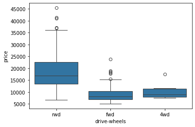
    


## Scatter Plors


```python
plt.scatter(x = df["engine-size"], y = df["price"])
plt.title("Scatterplot of Engine Size vs Proce")
plt.xlabel("Engine Size")
plt.ylabel("Price (USD)")
```


    Text(0, 0.5, 'Price (USD)')


    
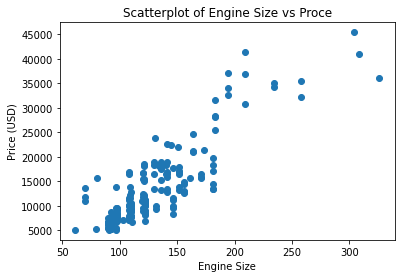
    


## Group by

The `df.groupby()` method is used for this purpose. The argument `as_index = False` will avoid merging cells for the 1st grouping variable.


```python
df_test = df[["drive-wheels", "body-style", "price"]]
df_grp = df_test.groupby(["drive-wheels", "body-style"], as_index = False).mean()
df_grp
```


<div>
<style scoped>
    .dataframe tbody tr th:only-of-type {
        vertical-align: middle;
    }

    .dataframe tbody tr th {
        vertical-align: top;
    }

    .dataframe thead th {
        text-align: right;
    }
</style>
<table border="1" class="dataframe">
  <thead>
    <tr style="text-align: right;">
      <th></th>
      <th>drive-wheels</th>
      <th>body-style</th>
      <th>price</th>
    </tr>
  </thead>
  <tbody>
    <tr>
      <th>0</th>
      <td>4wd</td>
      <td>hatchback</td>
      <td>7603.000000</td>
    </tr>
    <tr>
      <th>1</th>
      <td>4wd</td>
      <td>sedan</td>
      <td>12647.333333</td>
    </tr>
    <tr>
      <th>2</th>
      <td>4wd</td>
      <td>wagon</td>
      <td>9095.750000</td>
    </tr>
    <tr>
      <th>3</th>
      <td>fwd</td>
      <td>convertible</td>
      <td>11595.000000</td>
    </tr>
    <tr>
      <th>4</th>
      <td>fwd</td>
      <td>hardtop</td>
      <td>8249.000000</td>
    </tr>
    <tr>
      <th>5</th>
      <td>fwd</td>
      <td>hatchback</td>
      <td>8396.387755</td>
    </tr>
    <tr>
      <th>6</th>
      <td>fwd</td>
      <td>sedan</td>
      <td>9811.800000</td>
    </tr>
    <tr>
      <th>7</th>
      <td>fwd</td>
      <td>wagon</td>
      <td>9997.333333</td>
    </tr>
    <tr>
      <th>8</th>
      <td>rwd</td>
      <td>convertible</td>
      <td>23949.600000</td>
    </tr>
    <tr>
      <th>9</th>
      <td>rwd</td>
      <td>hardtop</td>
      <td>24202.714286</td>
    </tr>
    <tr>
      <th>10</th>
      <td>rwd</td>
      <td>hatchback</td>
      <td>14337.777778</td>
    </tr>
    <tr>
      <th>11</th>
      <td>rwd</td>
      <td>sedan</td>
      <td>21711.833333</td>
    </tr>
    <tr>
      <th>12</th>
      <td>rwd</td>
      <td>wagon</td>
      <td>16994.222222</td>
    </tr>
  </tbody>
</table>
</div>


```python
df_grp['price']
```


    0      7603.000000
    1     12647.333333
    2      9095.750000
    3     11595.000000
    4      8249.000000
    5      8396.387755
    6      9811.800000
    7      9997.333333
    8     23949.600000
    9     24202.714286
    10    14337.777778
    11    21711.833333
    12    16994.222222
    Name: price, dtype: float64


### The `pivot` method


```python
df_pivot = df_grp.pivot(columns = 'body-style', index = 'drive-wheels')
df_pivot
```


<div>
<style scoped>
    .dataframe tbody tr th:only-of-type {
        vertical-align: middle;
    }

    .dataframe tbody tr th {
        vertical-align: top;
    }

    .dataframe thead tr th {
        text-align: left;
    }

    .dataframe thead tr:last-of-type th {
        text-align: right;
    }
</style>
<table border="1" class="dataframe">
  <thead>
    <tr>
      <th></th>
      <th colspan="5" halign="left">price</th>
    </tr>
    <tr>
      <th>body-style</th>
      <th>convertible</th>
      <th>hardtop</th>
      <th>hatchback</th>
      <th>sedan</th>
      <th>wagon</th>
    </tr>
    <tr>
      <th>drive-wheels</th>
      <th></th>
      <th></th>
      <th></th>
      <th></th>
      <th></th>
    </tr>
  </thead>
  <tbody>
    <tr>
      <th>4wd</th>
      <td>NaN</td>
      <td>NaN</td>
      <td>7603.000000</td>
      <td>12647.333333</td>
      <td>9095.750000</td>
    </tr>
    <tr>
      <th>fwd</th>
      <td>11595.0</td>
      <td>8249.000000</td>
      <td>8396.387755</td>
      <td>9811.800000</td>
      <td>9997.333333</td>
    </tr>
    <tr>
      <th>rwd</th>
      <td>23949.6</td>
      <td>24202.714286</td>
      <td>14337.777778</td>
      <td>21711.833333</td>
      <td>16994.222222</td>
    </tr>
  </tbody>
</table>
</div>


### Heatmaps


```python
plt.pcolor(df_pivot, cmap = 'RdBu')
plt.colorbar()
plt.show()
```

    C:\Users\visne\AppData\Local\Temp\ipykernel_15448\1039962715.py:2: MatplotlibDeprecationWarning: Getting the array from a PolyQuadMesh will return the full array in the future (uncompressed). To get this behavior now set the PolyQuadMesh with a 2D array .set_array(data2d).
      plt.colorbar()
    


    
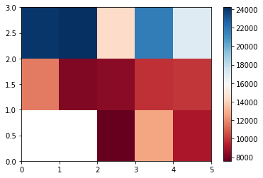
    


### Summary of plots

| Libraries     | Type of plot                   | Command                                 |
|:--------------|:-------------------------------|:----------------------------------------|
| Pyplot        | Line Plot                      | `plt.plot(x,y)`                         |
|               | Scatter Plot                   | `plt.scatter(x,y)`                      |
|               | Histogram                      | `plt.hist(x,bins)`                      |
|               | Bar Plot                       | `plt.bar(x,height)`                     |
|               | Pseudo Color Plot              | `plt.pcolor(C)`                         |
| Seaborn       | Regression Plot                | `sns.regplot(x, y ,data= df)`           |
|               | Box Plots                      | `sns.boxplot(x, y, data)`               |
|               | Residual Plot M1               | `sns.residplot(data,x, y)`              |
|               | Residual Plot M2               | `sns.residplot(x, y)`                   |
|               | KDE (Kernel Density Estimate)  | `sns.kdeplot(X)`                        |
|               | Distribution plot              | `sns.distplot(X,hist=False)`            |

## Correlation
To check the correlation between *engine size* and *price*, we can start with scatter plot to check if there is a linear relationship.


```python
sns.regplot(x = df['engine-size'], y = df['price'])
plt.xlim(0,)
plt.xlabel('Engine Size')
plt.ylabel('Price (USD)')
```


    Text(0, 0.5, 'Price (USD)')


    
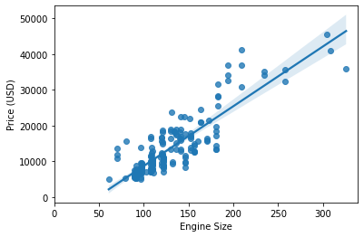
    


```python
sns.regplot(x = df['highway-mpg'], y = df['price'])
#plt.xlim(0,)
plt.ylim(0,)
plt.xlabel('Highway MPG')
plt.ylabel('Price (USD)')
```


    Text(0, 0.5, 'Price (USD)')


    
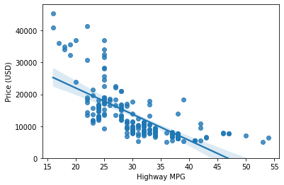
    


```python
sns.regplot(x = df['peak-rpm'], y = df['price'])
#plt.xlim(0,)
plt.ylim(0,)
plt.xlabel('Peak RPM')
plt.ylabel('Price (USD)')
```


    Text(0, 0.5, 'Price (USD)')


    
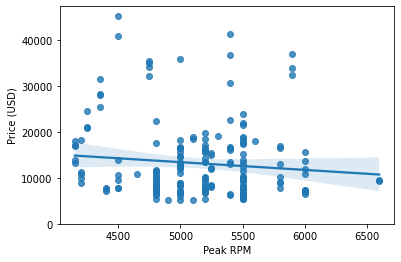
    


## Correlation Statistics
Let's discuss the Pearson correlations coefficient and associated p-value.


```python
pear = df[['horsepower','price']].dropna(axis = 0)
# pear.info()
R, p_value = stats.pearsonr(pear['horsepower'], pear['price'])
R, p_value
```


    (0.8105330821322061, 1.189127827694731e-47)


## Lesson Summary
At this point in the course, we know: 
* Tools like the `describe` function in pandas can quickly calculate key statistical measures like **mean**, **standard deviation**, and **quartiles** for all numerical variables in your data frame. 
* Use the `value_counts` function to summarize data into different categories for categorical data. 
* Box plots offer a more visual representation of the data's distribution for numerical data, indicating features like the **median**, **quartiles**, and **outliers**.
* Scatter plots are excellent for exploring relationships between continuous variables, like *engine size* and *price*, in a car data set.
* Use Pandas' `groupby` method to explore relationships between categorical variables.
* Use pivot tables and heat maps for better data visualizations.
* Correlation between variables is a statistical measure that indicates how the changes in one variable might be associated with changes in another variable.
* When exploring correlation, use scatter plots combined with a regression line to visualize relationships between variables.
* Visualization functions like `regplot`, from the seaborn library, are especially useful for exploring correlation.
* The Pearson correlation, a key method for assessing the correlation between continuous numerical variables, provides two critical values — the coefficient, which indicates the strength and direction of the correlation, and the P-value, which assesses the certainty of the correlation.
* A correlation coefficient close to 1 or -1 indicates a strong positive or negative correlation, respectively, while one close to zero suggests no correlation.
* For P-values, values less than .001 indicate strong certainty in the correlation, while larger values indicate less certainty. Both the coefficient and P-value are important for confirming a strong correlation.
* Heatmaps provide a comprehensive visual summary of the strength and direction of correlations among multiple variables.


# Model Development

A **model** is a amthematical equation used to predict one value given one or more values.

## Simple Linear Regression
Let *y* be the **target/dependent variable** and *x* the **predictor/independent variable**, the equation of the model is: $$y = b_0 + b_{1}x$$

where
* $b_0$: is the **intercept**
* $b_1$: is the **slope**

Steps to follow to perform a simple linear regression in Python include:

1. Import `linear_model` from scikit-learn (see cell 2)
1. Create a Linear Regression Object using the constructor
1. Define the predictor variable and the target variable
1. Use `lm.fit(X,Y` to fit he model, i.e. find the parameters $b_0$ and $b_1$
1. We can obtain a prediction


```python
sns.regplot(x = df['highway-mpg'], y = df['price'])
plt.ylim(0,)
```


    (0.0, 48159.60537295477)


    
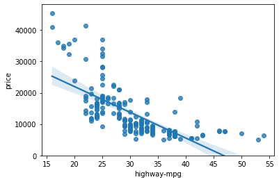
    


```python
Reg = df[['highway-mpg', 'price']]
# Reg.dropna(axis = 0)
Reg = Reg[np.isfinite(Reg).all(1)]

Reg.head()

lm = LinearRegression()
X = Reg[['highway-mpg']] # X must be a 2D array
Y = Reg['price']
lm.fit(X, Y)
```


    LinearRegression()


```python
# View Parameters
Yhat = lm.predict(X)
Yhat
```


    array([16236.50464347, 16236.50464347, 17058.23802179, 13771.3045085 ,
           20345.17153508, 17879.97140011, 17879.97140011, 17879.97140011,
           21988.63829172, 14593.03788682, 14593.03788682, 15414.77126514,
           15414.77126514, 17879.97140011, 20345.17153508, 20345.17153508,
           21988.63829172, -5128.5631929 ,  3088.77059031,  3088.77059031,
            4732.23734696,  7197.43748192, 13771.3045085 ,  7197.43748192,
            7197.43748192,  7197.43748192, 13771.3045085 , 13771.3045085 ,
           18701.70477843, -5950.29657123,  7197.43748192,  3910.50396864,
           10484.37099521, 10484.37099521, 10484.37099521, 10484.37099521,
           11306.10437353, 11306.10437353, 11306.10437353, 11306.10437353,
           15414.77126514, 12949.57113018, 14593.03788682, 14593.03788682,
           22810.37167004, 22810.37167004, 24453.83842668, 12949.57113018,
            7197.43748192,  7197.43748192,  7197.43748192,  7197.43748192,
           19523.43815675, 19523.43815675, 19523.43815675, 19523.43815675,
           12127.83775186, 12127.83775186, 12127.83775186, 12127.83775186,
            3910.50396864, 12127.83775186, 16236.50464347,  6375.7041036 ,
           17879.97140011, 17879.97140011, 17879.97140011, 17879.97140011,
           23632.10504836, 23632.10504836, 25275.57180501, 25275.57180501,
           18701.70477843,  4732.23734696,  7197.43748192,  7197.43748192,
           13771.3045085 , 13771.3045085 , 12127.83775186, 18701.70477843,
           18701.70477843, 18701.70477843, 12127.83775186, 12127.83775186,
           13771.3045085 , 13771.3045085 ,  8019.17086025, -2663.36305794,
            8019.17086025,  8019.17086025,  8019.17086025,  8019.17086025,
            8019.17086025,  8019.17086025,  8019.17086025,  8019.17086025,
           10484.37099521, 10484.37099521, 20345.17153508, 20345.17153508,
           17879.97140011, 17879.97140011, 19523.43815675, 17879.97140011,
           18701.70477843, 11306.10437353, 18701.70477843, 17879.97140011,
           18701.70477843, 11306.10437353, 18701.70477843, 17879.97140011,
           18701.70477843, 11306.10437353, 18701.70477843,  4732.23734696,
           13771.3045085 ,  7197.43748192,  7197.43748192,  7197.43748192,
           13771.3045085 , 18701.70477843, 16236.50464347, 17879.97140011,
           17879.97140011, 17879.97140011, 12949.57113018, 12949.57113018,
           15414.77126514, 15414.77126514, 15414.77126514, 15414.77126514,
           17058.23802179, 17058.23802179,  8840.90423857, 12949.57113018,
           12949.57113018,  8019.17086025, 11306.10437353, 12127.83775186,
           17879.97140011, 14593.03788682, 12127.83775186, 12949.57113018,
           14593.03788682, 19523.43815675,  6375.7041036 ,  7197.43748192,
            7197.43748192,  8019.17086025, 12127.83775186, 12127.83775186,
            8019.17086025,  8019.17086025,  8840.90423857,  -198.16292297,
            -198.16292297, 10484.37099521, 10484.37099521, 10484.37099521,
           10484.37099521, 14593.03788682, 14593.03788682, 13771.3045085 ,
           13771.3045085 , 13771.3045085 , 13771.3045085 , 13771.3045085 ,
           13771.3045085 , 10484.37099521, 11306.10437353, 12127.83775186,
           12127.83775186, 12127.83775186, 18701.70477843, 18701.70477843,
           18701.70477843, 18701.70477843,   623.57045535, 10484.37099521,
             623.57045535, 10484.37099521, 10484.37099521,  3910.50396864,
           12127.83775186, 14593.03788682, 14593.03788682, 18701.70477843,
            7197.43748192, 12949.57113018, 15414.77126514, 15414.77126514,
           15414.77126514, 15414.77126514, 20345.17153508, 20345.17153508,
           15414.77126514, 17879.97140011, 19523.43815675, 16236.50464347,
           17879.97140011])


```python
# b0 & b1
lm.intercept_, lm.coef_
```


    (38423.3058581574, array([-821.73337832]))


The equation becomes: $$Price = 38423.31 - 821.73\times Highway\_mpg$$

## Multiple Linear Regression
The equation is $$\hat{Y} = b_0 + b_1X_1 + b_2X_2+b_3X_3 + ... + b_nX_n$$

It takes the following steps:

1. Extract predictor vairables and store in a variable Z
1. Treain the model as before


```python
df2 = df[['price', 'horsepower', 'curb-weight', 'engine-size', 'highway-mpg']]
df3 = df2[np.isfinite(df2).all(1)]

z = df3[['horsepower', 'curb-weight', 'engine-size', 'highway-mpg']]
Y2 = df3['price']
lmm = LinearRegression()

lmm.fit(z, Y2)
```


    LinearRegression()


```python
Yhat2 = lmm.predict(z)
```


```python
lmm.intercept_
```


    -15700.5739790393


```python
lmm.coef_
```


    array([53.27878556,  4.66217408, 82.22948394, 35.5175845 ])


The equation becomes $$\hat{Price} = -15700.57 + 53.28 \times Horsepower + 4.66 \times curb\_weight + 82.23 \times engine\_size + 35.52 \times highway\_mpg$$

## Model Evaluation using Visualization

Here, we have:
1. Regression plot (Seaborn)
2. The residual plot
3. Distribution plot (distplot is deprecated, use displot or kdeplot)


```python
sns.residplot(x = X, y = Y)
```


    <Axes: xlabel='highway-mpg', ylabel='price'>


    
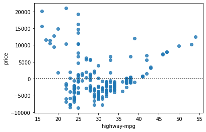
    


```python
ax1 = sns.kdeplot(Reg['price'], color = "r", label = "Actual Values")
sns.kdeplot(Yhat, color = "b", label = "Fitted Values", ax = ax1)
```


    <Axes: xlabel='price', ylabel='Density'>


    
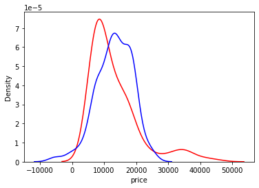
    


```python
ax1 = sns.kdeplot(df3['price'], color = "r", label = "Actual Values")
sns.kdeplot(Yhat2, color = "b", label = "Fitted Values", ax = ax1)
```


    <Axes: xlabel='price', ylabel='Density'>


    
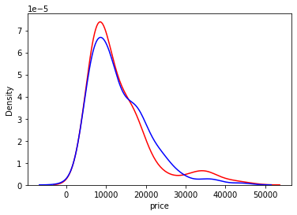
    


## Polynomial Regression and Pipelines
When the linear regression is not the best fit for our data, a polynomial regression can be considered. Here, the data is transformed into a polynomial and the linear regression is used to fit the parameters.

Pipelines are ways to simplify the code.

Polynomial reg is a case of general linear reg model, and is best to describe curvilinear relationships. The model can be:
* Quadratic - 2nd order polynomial regression where the equation is: $$\hat{Y} = b_0 + b_1X_1 + b_2(X_1)^2$$
* Cubic - 3rd order polynomial regression where the equation is: $$\hat{Y} = b_0 + b_1X_1 + b_2(X_1)^2 + b_3(X_1)^3$$
* Higher order polynomial regression where the equation is: $$\hat{Y} = b_0 + b_1X_1 + b_2(X_1)^2 + b_3(X_1)^3 + ...$$

### Example in Python
#### Polynomial Regression with one dimension
Calculate Polynomial of 3rd order


```python
f = np.polyfit(Reg['price'], Y, 3)
p = np.poly1d(f)
p
```


    poly1d([ 7.40516833e-25, -2.75757396e-20,  1.00000000e+00,  0.00000000e+00])


#### Polynomial Regression with one dimension Calculate Polynomial of 3rd order
`np` cannot deal with this. `preprocessing` lib in scikit-learn will be used
Here, the equation is in the format $$\hat{Y} = b_0 + b_1X_1 + b_2X_2 + b_3X_1X_2 + b_4(X_1)^2 + b_5(X_2)^2 + ...$$


```python
Scale = StandardScaler()
Scale.fit(df3[['horsepower', 'curb-weight']])
x_scale = Scale.transform(df3[['horsepower', 'curb-weight']])
```

### Pipelines
For pipelines, 
1. we'll import all the modules we need (`PolynomialFeature`, `LinearRegression`, and `StandardScaler`) and the library `Pipeline`
2. Create a list of tuples where the 1st element is the name of the estimator, and the 2nd contains model constructor.
3. Put the list in the pipeline constructor to create a pipeline object
4. The pipeline can be trained


```python
Input = [('polynomial', PolynomialFeatures(degree = 2)),
         ('scale', StandardScaler()),
         ('Model', LinearRegression())]

pipe = Pipeline(Input)

pipe.fit(z, Y2)

Yhat3 = pipe.predict(z)
```


```python
ax1 = sns.kdeplot(df3['price'], color = "r", label = "Actual Values")
sns.kdeplot(Yhat3, color = "b", label = "Fitted Values", ax = ax1)
```


    <Axes: xlabel='price', ylabel='Density'>


    
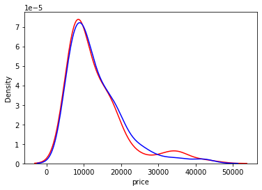
    


## Measures for In-Sample Evaluation
* A way to numerically determine how good the model fits on data
* Two important measures to determine the fit of a model:
    - Mean Squared Erro (MSE)
    - R-Squared ($R^2$) AKA the coefficient of determination (score)
    $$R^2 = 1 - \frac{MSE\ of\ Reg\ Line}{MSE\ of\ the\ AVG\ of\ the\ Data}$$
    
To measure the MSE in python, the module `mean_squared_error` from `sklearn.metrics` is used.

$R^2$ is generally between 0 and 1. If it's less than 0, it's a sign of overfitting. For interpretation of $R^2$, see **Falk & Miller (1992)**.


```python
mean_squared_error(df3['price'], Yhat3)
```


    9697923.625397738


```python
lm.score(X, Y)
```


    0.4965911884339176


## Prediction and Decison Making
To determine the final bast fit, we look at a combination of:
* Do the predicted values make sense?
* Viz
* Numerical measures for evaluation
* Comparing models

Note that the `seq()` dunction is R is implement in Python with `np.arange(from, to, by)`

### Comparing MLR and SLR
1. A lower MSE does not always imply a better fit.
1. MSE for an MLR model will always be smaller than the MSE for a SLR model since the errors of the adta will decrease when more variables are included in the model.
1. Polynomial regression will also have a smaller MSE than regular regression.
1. A similar inverse relationship holds for $R^2$.


## Lesson Summary
At this point in the course, we know: 
* Linear regression refers to using one independent variable to make a prediction.
* You can use multiple linear regression to explain the relationship between one continuous target y variable and two or more predictor x variables.
* Simple linear regression, or SLR, is a method used to understand the relationship between two variables, the predictor independent variable x and the target dependent variable y.
* Use the `regplot` and `residplot` functions in the `Seaborn library` to create regression and residual plots, which help you identify the strength, direction, and linearity of the relationship between your independent and dependent variables.
* When using residual plots for model evaluation, residuals should ideally have zero mean, appear evenly distributed around the x-axis, and have consistent variance. If these conditions are not met, consider adjusting your model.
* Use distribution plots for models with multiple features: Learn to construct distribution plots to compare predicted and actual values, particularly when your model includes more than one independent variable. Know that this can offer deeper insights into the accuracy of your model across different ranges of values.
* The order of the polynomials affects the fit of the model to your data. Apply Python's `polyfit` function to develop polynomial regression models that suit your specific dataset.
* To prepare your data for more accurate modeling, use feature transformation techniques, particularly using the `preprocessing` library in `scikit-learn`, transform your data using `polynomial features`, and use the modules like `StandardScaler` to normalize the data.
* Pipelines allow you to simplify how you perform transformations and predictions sequentially, and you can use pipelines in `scikit-learn` to streamline your modeling process.
* You can construct and train a pipeline to automate tasks such as normalization, polynomial transformation, and making predictions.
* To determine the fit of your model, you can perform sample evaluations by using the **Mean Square Error (MSE)**, using Python’s `mean_squared_error` function from `scikit-learn`, and using the score method to obtain the `R-squared` value.
* A model with a high `R-squared` value close to 1 and a low `MSE` is generally a good fit, whereas a model with a low `R-squared` and a high `MSE` may not be useful.
* Be alert to situations where your `R-squared` value might be negative, which can indicate **overfitting**. 
* When evaluating models, use visualization and numerical measures and compare different models.
* The mean square error is perhaps the most intuitive numerical measure for determining whether a model is good.
* A distribution plot is a suitable method for multiple linear regression.
* An acceptable `r-squared` value depends on what you are studying and your use case.
* To evaluate your model’s fit, apply visualization, methods like regression and residual plots, and numerical measures such as the model's coefficients for sensibility: 
* Use Mean Square Error (`MSE`) to measure the average of the squares of the errors between actual and predicted values and examine `R-squared` to understand the proportion of the variance in the dependent variable that is predictable from the independent variables.
* When analyzing residual plots, residuals should be randomly distributed around zero for a good model. In contrast, a residual plot curve or inaccuracies in certain ranges suggest non-linear behavior or the need for more data.

<h1><b>Model Evaluation and Refinement</b></h1>

* In-sample evaluation tells how well the model will fit the data used to train it. It does not tell how well the trained model can be used to predict new data
* The solution is to split the data into two parts: I-sample data or training data (the larger part ~70%) and out-of-sample evaluation or test set/testing data (Smaller part ~30%)
* When the testing is completed, all the data should be used to train the model to get the best performance.

To carry-out this technique, the function `train_test_split` from `sklearn.model_selection` is used.

* Generalization error is a measure of how well the data does at predicting previously unseen data
* The error we obtain using our testing data is an approximation of this error


```python
x_train, x_test, y_train, y_test = train_test_split(z, Y2, test_size = .3, random_state = 0)
```

<h2><b>Cross Validation</b></h2>
* One of the most common out-of-sample evaluation metrics
* More effective use of data (each observation is used for both training and testing)

An evaluation matrics that can be used is $R^2$, calculated using the function `cross_val_score()` from `sklearn.model_selection` which perform multiple our-of-sample validation


```python
# cv sets the number of partitions
scores = cross_val_score(lmm, z, Y2, cv = 3)
print(scores), np.mean(scores)
```

    [0.78952607 0.74392426 0.54069997]
    


    (None, 0.6913834309135737)


The function `cross_val_predict()` returns the prediction that was returned for each element when it was in the test set


```python
Yhat4 = cross_val_predict(lmm, z, Y2, cv = 3)
print(Yhat4)
```

    [12827.47262967 12827.47262967 18183.75643728  9637.90934399
     14204.7597532  13061.68705776 14357.97461852 14781.09518731
     15644.78176848  9601.85897259  9601.85897259 17694.4938675
     17906.05415189 18709.31377517 26803.44290734 27380.42550115
     27653.0842906   1039.50702321  5650.17504454  5784.80431643
      5355.32562495  5043.08556686  7647.3107435   5393.12167377
      5477.74578753  5477.74578753  7889.6434329  11141.2766073
     17936.23281055  5825.22380868  5417.12020417  3745.1907217
      5466.23275239  5527.7775624   5735.49129617  5789.34300493
      8914.46697926  9118.3341624   9176.03242179  9437.59786431
      9982.79559151  9586.23770097  8616.99763377 11573.40550275
     34709.84504112 34709.84504112 45449.70707389  4476.25618732
      5243.28182912  5262.51458225  5416.37660727  5435.60936039
      4820.27680143  4820.27680143  4839.50955456  7965.15554493
     10583.689088   10679.85285363 10583.689088   10679.85285363
     10903.76439677 10737.55111301 14800.263448   13252.16634489
     22622.81144276 23526.75083973 22545.88043026 26255.81884087
     29091.33080849 28635.69167166 34424.68923494 32748.17295929
     20123.91069187  5687.21722717  5755.20112474  6252.26200128
      8935.82215574 11928.52628479 10716.61190988 18568.11326174
     19297.13588067 19338.55762038 11023.13278375 11354.50670145
     12201.90976689 12201.90976689  5480.1004966   6698.14774832
      5720.34658693  5886.03354578  6598.48746882  5993.73006903
      6631.62486059  6159.41702788  6706.18399208  6465.93790175
     11157.85641006 10975.60075532 21888.28413264 23553.43806907
     21745.7411036  22235.14900131 24691.61224714 22798.48466139
     16432.39874818 19392.68101365 18172.11181608 20929.8430204
     16788.46786743 19848.32015049 18528.18093533 21385.48215723
     16888.03788501 19848.32015049 20087.69408958  5615.26127402
      8794.98824071  5873.78517426  6056.04082899  8017.30292597
     12333.199168   18443.8480426  17980.42337338 22433.1885082
     22433.1885082  22797.69981766 14313.19341583 14619.7142897
     14719.126465   15141.62821007 17946.82328087 18269.91285062
      6764.74413235  8328.43212984  8821.8686125   9192.35878491
      9252.37481088 10602.70595753  9804.16378515 12291.4281934
      9632.31621601 11044.32692299 10073.10541428 12679.5701073
      5973.2984715   6168.20119563  6065.40192841  7123.81849719
      7008.6598853  10380.47585011  7321.27375443  7436.40893371
      8207.23723521  8551.04953652  7687.28601094  7396.0975614
      7470.1130338   7589.36018378  7733.27915788 10504.60027592
     10648.51925003 15968.59123816 15952.14335541 16013.82291574
     16540.15516391 16684.07413802 17757.29848779 11660.56327326
     10039.87844519 11959.90536636 11959.90536636 12140.83207667
     22549.6627508  22714.14157835 22868.35520461 22107.46691908
      7111.22987166  9637.26848943  7123.56578372  9649.6044015
      9908.65855489  8244.42312603 10904.93550345  9984.6918546
      9848.99682187 15053.08240612  9188.51285009 11190.33692377
     16886.70395605 17388.36438008 16981.27928189 17421.26014559
     19377.78643422 19838.32715136 17051.1827836  20287.97657631
     21114.28335576 17936.98962738 17409.7325681 ]
    

## Overfitting, Underfitting, and Model Selection
**Underfitting** is when the model is too simple to fit the data like in the figure below


On the other hand, **Overfitting** is when the model is too flexible and fits the noise rather than the function.


$R^2$ can be used to determine which order of polynomial regression would fit the data better.


```python
Rsqu_test = []
order = [1,2,3,4]
for n in order:
    pr = PolynomialFeatures(degree = n)
    x_train_pr = pr.fit_transform(x_train[['horsepower']])
    x_test_pr = pr.fit_transform(x_test[['horsepower']])
    
    lmm.fit(x_train_pr, y_train)
    
    Rsqu_test.append(lmm.score(x_test_pr, y_test))
```


```python
print(Rsqu_test)
```

    [0.6744455628629881, 0.6764473389271954, 0.6812379920245005, 0.6862312998249094]
    

# Introduction to Ridge Regression
For models with multiple independent features and ones with polynomial feature extrapolation, it is common to have colinear combinations of features. Left unchecked, this multicollinearity of features can lead the model to overfit the training data. To control this, the feature sets are typically regularized using hyperparameters.

Ridge regression is the process of regularizing the feature set using the hyperparameter alpha. The upcoming video shows how Ridge regression can be utilized to regularize and reduce standard errors and avoid over-fitting while using a regression model.

A low value of alpha can lead to overfitting, while a high aplha will lead to underfitting. To select an optimal alpha, we can use cross validation. The module `Ridge()` from `sklern.linear_model` is necessary.


```python
RidgeModel = Ridge(alpha = .1)
RidgeModel.fit(z, Y2)
Yhat4 = RidgeModel.predict(z)
```


```python
Yhat4
```


    array([13741.40310989, 13741.40310989, 19088.01131102, 10657.90694623,
           15557.0725999 , 13919.32085811, 15490.4708376 , 16003.30910983,
           17628.34537646, 10757.28853225, 10757.28853225, 17860.77913969,
           18117.1982758 , 19362.67859229, 27022.33155784, 27721.65647453,
           28233.39533459,   692.53465127,  5693.7559333 ,  5856.93174719,
            5525.49118555,  5418.94332978,  8778.98963605,  5843.2004459 ,
            5945.76810035,  5945.76810035,  9072.70610106, 11904.09921324,
           18810.44415509,  4858.93862073,  5743.88758282,  4048.42936172,
            6165.94587458,  6240.54053236,  6492.29750236,  6557.56782792,
            9523.34812425,  9770.44292815,  9840.37541982, 10157.40271538,
           11212.58322501, 10463.95992159,  9508.16389776, 12656.22296823,
           34522.92895667, 34522.92895667, 44084.65093161,  5317.83150031,
            5613.0648249 ,  5636.37565545,  5822.8622999 ,  5846.17313046,
            7349.539008  ,  7349.539008  ,  7372.84983855, 10542.76601988,
           11062.69184816, 11179.24600095, 11062.69184816, 11179.24600095,
           10622.68524065, 11249.17849261, 15611.98975249, 13127.29688133,
           23176.1928401 , 24271.80187624, 23082.94951787, 24365.04519846,
           29875.18830046, 29618.76916434, 38180.16565334, 36988.74688897,
           19554.68410674,  5885.76117912,  5900.42964224,  6180.15960891,
            8858.24645994, 11639.8881692 , 11010.06273207, 18913.01180953,
           19323.28242732, 19346.59325788, 11182.56287818, 11369.04952263,
           11793.73965087, 11793.73965087,  6072.9206845 ,  6878.8621396 ,
            6208.12350172,  6301.36682395,  6702.31310951,  6361.97498339,
            6720.96177396,  6455.21830562,  6762.92126896,  6627.71845173,
           11377.49424712, 11274.92659267, 22492.15525446, 23429.25064282,
           22435.52729634, 22913.03982805, 25290.17874218, 23230.06712361,
           14267.20234129, 17936.83640453, 15246.25722465, 18738.99349305,
           14417.06430129, 18193.25554065, 15396.11918465, 18995.41262917,
           14523.62147741, 18193.25554065, 18328.79019452,  5721.30216222,
            8778.98963605,  5843.2004459 ,  5945.76810035,  7545.3617224 ,
           11904.09921324, 18843.07931786, 18245.43581083, 25017.53475168,
           25017.53475168, 25222.67006057, 13496.41316996, 13668.91331607,
           13724.85930941, 13962.62978108, 16788.63558581, 16970.46006415,
            6788.01347648,  8054.42428982,  8613.88422317,  8863.58144669,
            8931.315114  , 10234.46713549,  9556.30989029, 11826.22351565,
            9362.0157732 , 10735.10028635,  9861.54951189, 12265.83105967,
            5807.42287636,  6028.32606055,  5911.77190777,  7111.72997533,
            6980.77187682, 10803.74808803,  7103.56467436,  7234.10532548,
            8213.36281655,  8604.03828772,  7519.33235305,  7188.16562915,
            7272.08461915,  7407.28743638,  7570.46325027,  9914.97632197,
           10078.15213587, 15392.71871225, 15374.07004781, 15444.00253948,
           16040.75980171, 16203.93561561, 17420.76097064, 11284.88465593,
            9968.29501061, 11624.12336987, 11624.12336987, 11829.25867877,
           21665.60159913, 21852.08824358, 22121.84440607, 21392.79264381,
            7221.15404817,  9297.47749467,  7235.1405465 ,  9311.463993  ,
            9605.18045801,  8201.95328389, 10449.88152785,  9596.08815035,
            9442.23666868, 14601.77848732,  9272.05266511, 11001.17220645,
           16538.30788342, 17107.09214899, 16645.53770398, 17144.38947788,
           18598.12789863, 19120.29050309, 16724.79452787, 19521.29183566,
           20523.86076648, 17827.44192473, 17131.08494433])


## Grid Search
Grid Search allows to scan through multiple free parameters with few lines of code.

Alpha in Ridge regression is called a hyperparameter

scikit-learn has a means to automatically iterating ove these hyperparameters using cross-validation called Grid Search


```python
parameters1 = [{'alpha': [.001,.1,1,10,100,1000,10000,100000,1000000]}]

RR = Ridge()

Grid1 = GridSearchCV(RR, parameters1, cv = 4)

Grid1.fit(z, Y2)

Grid1.best_estimator_
```


    Ridge(alpha=10000)


```python
scores = Grid1.cv_results_
scores['mean_test_score']
```


    array([0.64703019, 0.64703064, 0.64703477, 0.6470758 , 0.64746007,
           0.64975482, 0.65246626, 0.64186174, 0.61255388])


## Lesson Summary
At this point in the course, we know: 
* How to split your data using the `train_test_split()` method into training and test sets. You use the training set to train a model, discover possible predictive relationships, and then use the test set to test your model to evaluate its performance.
* How to use the generalization error to measure how well your data does at predicting previously unseen data.
* How to use cross-validation by splitting the data into folds where you use some of the folds as a training set, which we use to train the model, and the remaining parts are used as a test set, which we use to test the model. You iterate through the folds until you use each partition for training and testing. At the end, you average results as the estimate of out-of-sample error.
* How to pick the best polynomial order and problems that arise when selecting the wrong order polynomial by analyzing models that underfit and overfit your data.
* Select the best order of a polynomial to fit your data by minimizing the test error using a graph comparing the mean square error to the order of the fitted polynomials.
* You should use ridge regression when there is a strong relationship among the independent variables.  
* That ridge regression prevents overfitting.
* Ridge regression controls the magnitude of polynomial coefficients by introducing a hyperparameter, alpha. 
* To determine alpha, you divide your data into training  and validation data. Starting with a small value for alpha, you train the model, make a prediction using the validation data, then calculate the R-squared and store the vaues. You repeat the value for a larger value of alpha. You repeat the process for different alpha values, training the model, and making a prediction. You select the value of alpha that maximizes R-squared.
* That grid search allows you to scan through multiple hyperparameters using the `Scikit-learn` library, which iterates over these parameters using cross-validation. Based on the results of the grid search method, you select optimum hyperparameter values.
* The `GridSearchCV()` method takes in a dictionary as its argument where the key is the name of the hyperparameter, and the values are the hyperparameter values you wish to iterate over.
